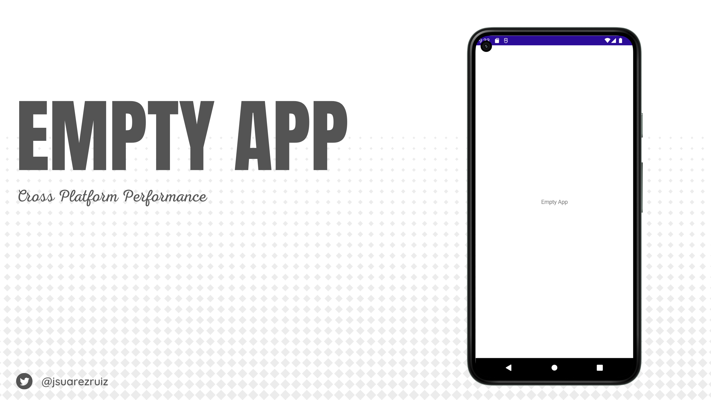
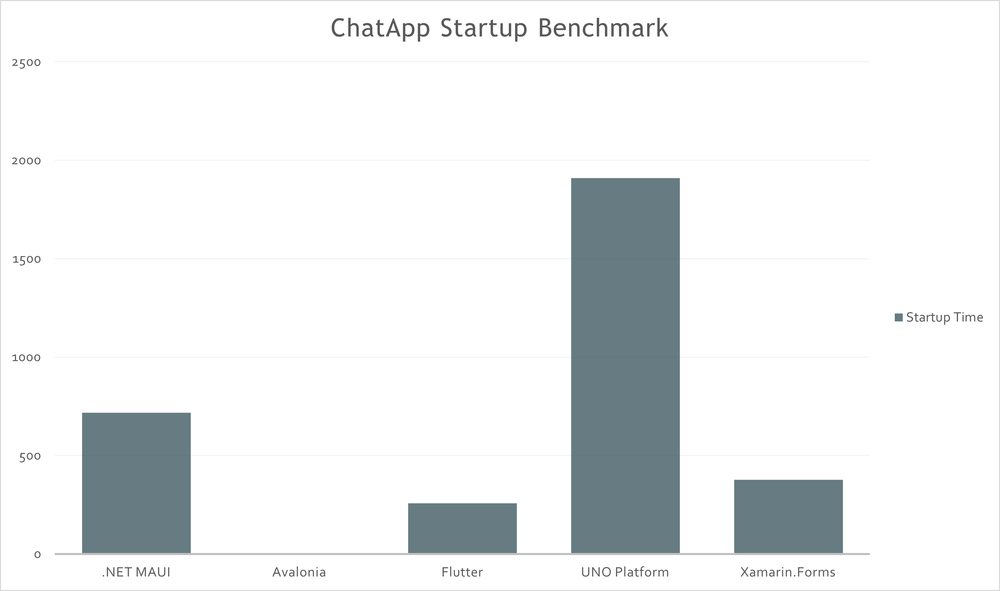

# Cross Platform frameworks benchmarks

This repository is a set of tests and **benchmarks** to analyze the evolution in different aspects related to performance (boot time, memory consumption, etc.) in different **cross platform frameworks**.

The following frameworks are measured in this repository:
- .NET MAUI
- Avalonia
- Flutter
- UNO Platform
- Xamarin.Forms

_(**Work in progress**, missing examples, missing metrics, etc.)_

## Benchmarks

At the moment, we have three different test blocks:
- **EmptyApp**: Yes, something as simple as an empty App can give us a lot of information. It can give us information such as the minimum startup time in each framework, etc.
- **ChatApp**: An empty application cannot give us all the information we are looking for, what is the performance with real applications? For that reason, we measure again startup time along with other parameters in a real application.
- **DopeTest**: This test is basically based on rendering hundreds of texts and measuring the performance of Layouts, rendering, etc.

_NOTE: A Poco F2 Pro has been used to obtain the data._

### Empty App

#### Startup time

| Android App | Framework           | Profiled AOT Time (ms) |
|-------------|---------------------| ---------------------:|
| EmptyApp    |  .NET MAUI          |                 380.4 |
| EmptyApp    |  Avalonia           |                 - |
| EmptyApp    |  Flutter            |                 239,7 |
| EmptyApp    |  UNO Platform       |                 1026.1 |
| EmptyApp    |  Xamarin.Forms      |                 - |

#### Package size

| Android App | Framework           | Profiled AOT Time (MBs) |
|-------------|---------------------| ---------------------:|
| EmptyApp    |  .NET MAUI          |                 29.1 |
| EmptyApp    |  Avalonia           |                 - |
| EmptyApp    |  Flutter            |                 16.3 |
| EmptyApp    |  UNO Platform       |                 28.2 |
| EmptyApp    |  Xamarin.Forms      |                 - |

### Chat App

#### Startup time

| Android App | Framework           | Profiled AOT Time(ms) |
|-------------|---------------------| ---------------------:|
| ChatApp    |  .NET MAUI          |                 - |
| ChatApp    |  Avalonia           |                 - |
| ChatApp    |  Flutter            |                 - |
| ChatApp    |  UNO Platform       |                 - |
| ChatApp    |  Xamarin.Forms      |                 - |

#### Package size

| Android App | Framework           | Profiled AOT Time(MBs) |
|-------------|---------------------| ---------------------:|
| ChatApp    |  .NET MAUI          |                 - |
| ChatApp    |  Avalonia           |                 - |
| ChatApp    |  Flutter            |                 - |
| ChatApp    |  UNO Platform       |                 - |
| ChatApp    |  Xamarin.Forms      |                 - |

## Dope Test

This test is based on rendering hundreds of texts and measuring the performance of Layouts, rendering, etc.

Inspired by https://github.com/maxim-saplin/dopetest_flutter by Maxim Saplin.

| Android App | Framework           | Build |
|-------------|---------------------| ---------------------:|
| DopeTest    |  .NET MAUI          |                 42.3 |
| DopeTest    |  Avalonia           |                 - |
| DopeTest    |  Flutter            |                 - |
| DopeTest    |  UNO Platform       |                 91.9 |
| DopeTest    |  Xamarin.Forms      |                 68.5 |

_(higher values are better)_

## Contribute

_"The data in [insert device here] is different. Why isn't  [insert cross platform framework here] here?"_

Contributions are welcome, you can launch the same benchmarks on another device and add the data to the repository; you can create the examples used in another framework; you can add more tests to measure memory etc.

## Copyright and license

Code released under the [MIT license](https://opensource.org/licenses/MIT).